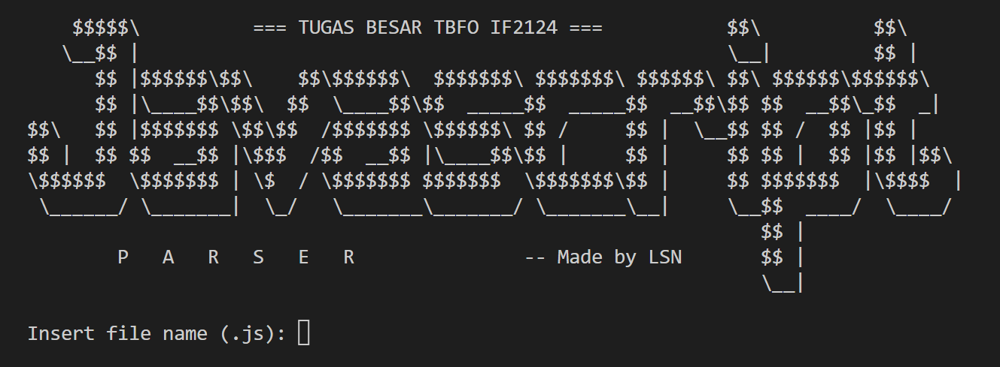

# Javascript Parser with CYK Algorithm
> Source Code ini dibuat oleh kami, Kelompok LSN, untuk memenuhi Tugas Besar Teori Bahasa Formal dan Otomata yaitu mengimplementasikan 
> Parser Syntax bahasa Javascript dengan Algoritma CYK (Cocke-Younger-Kasami)

## Daftar Isi
* [Anggota Kelompok](#anggota-kelompok)
* [Implementasi Program](#implementasi-program)
* [Sistematika File](#sistematika-file)
* [Cara Menjalankan Program](#cara-menjalankan-program)
* [Screenshots](#screenshots)

## Anggota Kelompok
NIM | Nama |
--- | --- |
13521108 | Michael Leon Putra Widhi |
13521168 | Satria Octavianus Nababan |
13521172 | Nathan Tenka

## Implementasi Program
Pada Tugas Besar kali ini, program yang kami buat dapat digunakan untuk :
1. Menerima input berupa file eksternal berisi string yang merupakan kode sebuah program JavaScript (Node.js)
2. Melakukan evaluasi sintaks dengan CFG
3. Melakukan evaluasi nama-nama variabel dan operasi yang ada dengan FA
4. Memberikan keluaran hasil evaluasi program antara “Accepted” jika input diterima atau “Syntax Error” jika input tidak diterima
5. [BONUS] Memberi tahu letak dan detail kesalahan syntax jika ada 

## Sistematika File
```bash
.
├─── doc
├─── test
│   ├─── functionAcc.js
│   ├─── functionReject1.js
│   ├─── functionReject2.js
│   ├─── ifAcc.js
│   ├─── ifReject.js
│   ├─── inputAcc.js
│   ├─── inputReject.js
│   ├─── loopAcc.js
│   ├─── loopReject.js
│   ├─── switchAcc.js
│   ├─── switchReject.js
│   ├─── testProgAsli.js
│   ├─── throwDeleteAcc.js
│   ├─── throwDeleteReject.js
│   ├─── tryCatchTestAcc.js
│   ├─── tryCatchTestReject.js
│   ├─── variablesReject.js
│   ├─── varLetConstAcc.js
│   └─── varLetConstReject.js
├─── CFG.txt
├─── CNF.txt
├─── Converter.py
├─── CYK.py
├─── FA.py
├─── LexerGrammar.py
├─── main.py
└─── README.md
```

## Cara Menjalankan Program
1. Pastikan Python 3 versi terbaru sudah terpasang pada mesin eksekusi (Anda dapat mengecek versi Python 3 dengan menjalankan command `python --version` pada command prompt).
2. Jalankan run pada `interface.py`.
3. Jika berhasil dikompilasi, maka akan muncul tampilan interface.
4. Masukkan path file yang ingin diparsing, misalkan path untuk file yang diterima pada Spesifikasi Tugas Besar adalah
```bash
test/functionAcc.js
```
5. Tunggu hasil verdict.

Program akan menampilkan "Accepted" berwarna hijau jika file javascript yang dimasukkan sesuai dengan aturan syntax yang benar dan menampilkan "Syntax Error" berwarna kuning jika tidak sesuai dengan aturan syntax yang benar, lengkap dengan letak dan detail line kesalahan syntax berada.

## Screenshots
